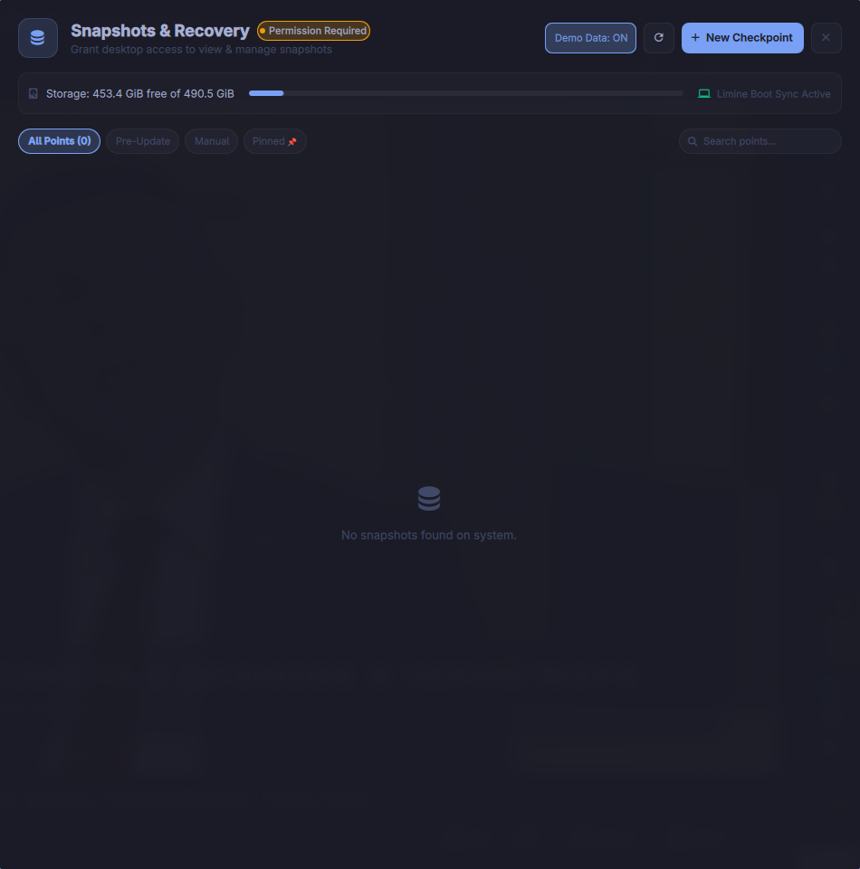
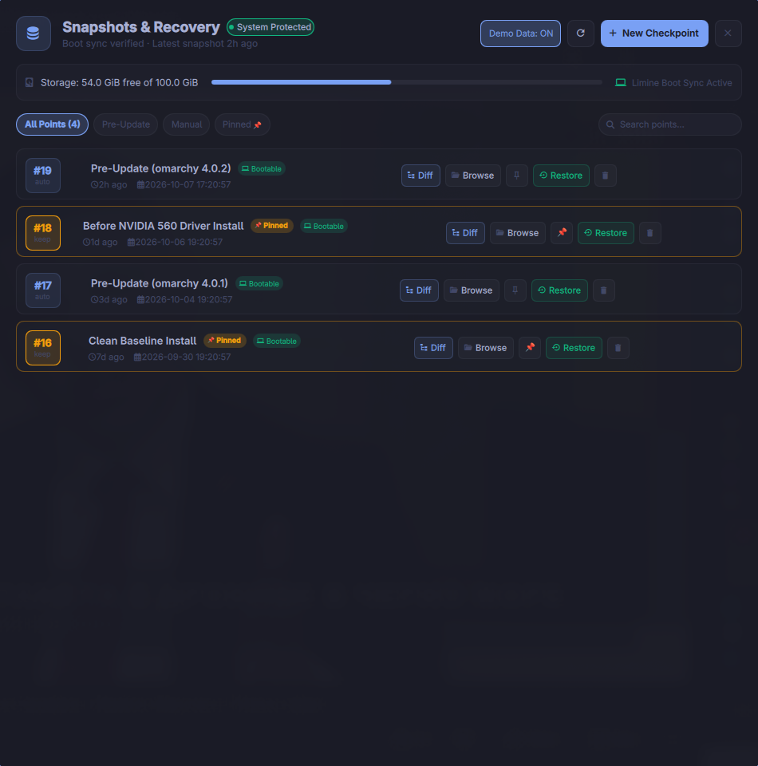
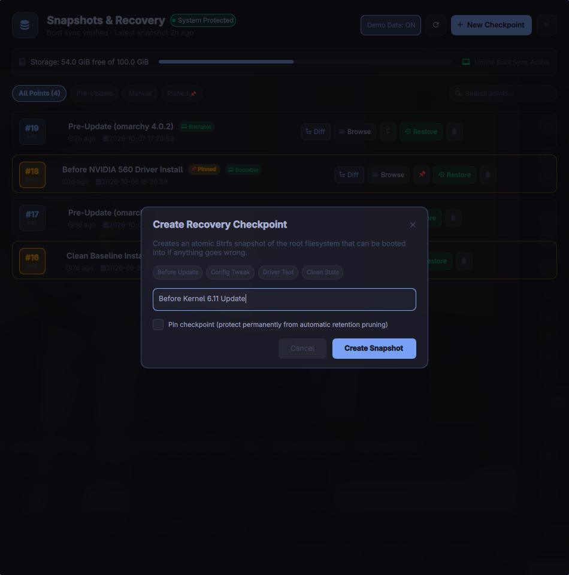

# Snapshots & Recovery (`ac.snapshots`)

[](https://plugins.omarchy.org/)
[](https://quickshell.outfoxxed.me/)
[](https://plugins.omarchy.org/)
[](LICENSE)

A native **Btrfs & Snapper snapshot manager and system recovery HUD** for [Omarchy](https://omarchy.org/) Linux. 

Inspect system recovery points, verify Limine bootloader synchronization, inspect package and config file diffs, browse snapshot directories, and trigger safe rollbacks directly from your desktop.


---

## The Problem It Solves

Omarchy configures Btrfs and Snapper out-of-the-box, taking automatic snapshots right before running `omarchy update`. However, users have **zero desktop visibility** into their recovery points:

1. **The Silent Boot Failure Risk**: If `limine-snapper-sync` quietly stalls or fails in the background, you won't know your snapshots aren't bootable until your system breaks and you reboot into an empty menu.
2. **Hidden Disk Bloat**: Without visual storage telemetry, outdated snapshots can lock tens of gigabytes of disk space on your NVMe.
3. **No Granular File Recovery**: If you break a single config file in `~/.config/hypr/` or `/etc/fstab`, you shouldn't have to roll back the entire OS. You just want to grab that one file from two hours ago.
4. **Terminal Friction Before Risky Tests**: Testing an AUR kernel or new GPU driver requires remembering cryptic CLI flags instead of hitting a single hotkey to create a named checkpoint.

`ac.snapshots` bridges this gap with a sleek, keyboard-friendly Quickshell interface.

---

## Visual Showcase

| Recovery Timeline & Health | Change Diff Inspector |
| :---: | :---: |
|  |  |
| *Live health indicator, storage telemetry, boot sync status, and recovery points* | *Filterable list of added, modified, and deleted packages and configs* |

| New Checkpoint Dialog | Safe Rollback Confirmation |
| :---: | :---: |
|  |  |
| *One-click named checkpoints with quick preset chips & auto-prune pinning* | *Guided safety confirmation before executing Limine bootloader rollback* |

---

## Key Features

- **Recovery Readiness Health Check**:
  - Live indicator dot: **Protected** (sync active & recent snapshots) vs. **Warning** (stale snapshots or permissions required) vs. **Error** (Snapper offline).
  - Automatically verifies whether `limine-snapper-sync.service` is actively tracking `/.snapshots` and keeping your boot menu up-to-date.
- **Visual Recovery Timeline**:
  - Grouped cards showing Snapshot ID (`#19`), relative age (`2h ago`), exact timestamp, trigger reason (`Pre-Update`, `Manual Checkpoint`), and auto-prune algorithm.
  - Search and filter pills: `[All]`, `[Pre-Update]`, `[Manual]`, `[Pinned 📌]`.
- **Change Diff Inspector**:
  - Compares any snapshot against your running system.
  - Instant counts of `+X added`, `~Y modified`, `-Z deleted` files with instant search/filter.
- **Snapshot Pinning (`📌`)**:
  - Protect critical milestones from Snapper's automatic `NUMBER_LIMIT` retention cleanup with one click.
- **Time Machine File Recovery**:
  - Click **[Browse]** to open `/.snapshots/<id>/snapshot/` in your file manager to restore individual files without rebooting.
- **One-Click Authorization**:
  - Built-in `[Authorize Access]` banner allows wheel users to configure passwordless desktop access via `pkexec` in seconds.
- **Interactive Status Bar Widget**:
  - Minimalist bar pill showing snapshot status glyph and active health badge. Left-click toggles the HUD; right-click opens the creation dialog.

---

## Installation

### Method 1: Using the Omarchy CLI
```bash
omarchy plugin add https://github.com/atanas-chalakov/omarchy-snapshots --enable
```

### Method 2: Manual Clone
```bash
git clone https://github.com/atanas-chalakov/omarchy-snapshots ~/.config/omarchy/plugins/ac.snapshots
omarchy-shell shell rescanPlugins
omarchy plugin enable ac.snapshots
```

---

## Recommended Hyprland Keybinding

Add a convenient hotkey to summon the Snapshots HUD anywhere in your desktop. Add this to `~/.config/hypr/bindings.lua`:

```lua
-- Summon Snapshots & Recovery HUD
o.bind("SUPER ALT", "S", "omarchy-shell shell toggle ac.snapshots")
```

---

## CLI Reference (`omarchy-snapshots`)

A standalone CLI tool is included in `bin/omarchy-snapshots`:

```bash
# List all snapshots with health summary and storage telemetry
omarchy-snapshots list

# Create a manual checkpoint with a custom description
omarchy-snapshots create --desc "Before testing experimental kernel"

# Create a pinned snapshot (protected from auto-cleanup)
omarchy-snapshots create --desc "Stable Baseline" --important

# Inspect file changes in a snapshot
omarchy-snapshots diff --id 19

# Pin or unpin a snapshot
omarchy-snapshots pin --id 18
omarchy-snapshots unpin --id 18

# Delete a snapshot
omarchy-snapshots delete --id 17

# One-time authorization for passwordless desktop access
omarchy-snapshots authorize

# Output structured JSON for automation or scripting
omarchy-snapshots json
```

---

## Running the Automated Test Suite

```bash
# Run the entire unified test suite (Validator, Unit Engine, CLI, QML, and IPC)
./tests/run_all_tests.sh

# Or run individual test modules
python3 -m unittest tests/test_unit_engine.py
python3 -m unittest tests/test_cli_commands.py
python3 -m unittest tests/test_qml_and_manifest.py
python3 -m unittest tests/test_ipc_integration.py
```

---

## License

MIT License. Designed with care for the Omarchy Linux community.
